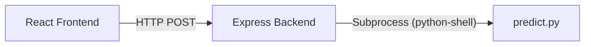

# Free Deployment Guide: Frontend & ML/Prediction Engine

This guide details how to deploy this project for free. It covers hosting your **React frontend** on **Vercel** and your **Node.js backend + Python ML/Prediction engine** using free hosting services.

---

## 1. Architectural Challenge on Vercel

Your project currently uses this flow:


**The Vercel Limitation:**
Vercel is a **Serverless** platform. It doesn't host continuous Node.js processes. While you *can* run Express routes as serverless functions on Vercel, a Node.js serverless function cannot run Python shell scripts because the Node.js container does not have a Python interpreter or libraries (like `numpy` or `joblib`) installed.

---

## 2. Key Discovery: The "ML Engine" is Optional for Predictions

Looking at `server/ml/predict.py`, the `predict` function called by your Node.js server is actually a **mathematical simulation** rather than active XGBoost inference:
* The script loads `model.pkl` in a `try-except` block, but **never uses it** in the `predict` function.
* The output is computed entirely using standard math based on historical rates and pledge inputs.

This gives you two choices for deployment:

| Strategy | Backend Hosting | Complexity | Performance |
| :--- | :--- | :--- | :--- |
| **Strategy A: Pure Vercel (Recommended)** | Vercel (as JS serverless function) | **Low** (Rewrite math in JS, drop Python) | **Fastest** (<100ms response, no cold starts) |
| **Strategy B: Hybrid (Vercel + Docker)** | Vercel (Frontend) + Hugging Face / Render (Backend + Python) | **Medium** (Uses custom Dockerfile) | **Slower** (Render has 50s cold-start on free tier) |

---

## 3. Strategy A: Pure Vercel (Re-engineered for Serverless)

If you translate the mathematical model in `predict.py` into JavaScript, you can run the entire project on Vercel's free tier without needing Python or complex Docker setups.

### Step 1: Add a JS prediction fallback in Express
Modify `server/index.js` to execute predictions in Javascript if Python is unavailable or if you want to deploy to serverless:

```javascript
// A pure Javascript implementation of server/ml/predict.py
function calculatePredictions(ch4, gdp, growth, agr, investment, years = 10) {
    const LOSS_PER_MT_USD_BN = 2.1;
    const HISTORICAL_CH4_GROWTH = 0.009;
    const GLOBAL_PLEDGE_REDUCTION = 0.30;
    
    const ACT_NOW_RATE = -(GLOBAL_PLEDGE_REDUCTION / years);
    const results = [];
    let ch4_bau = ch4;
    let ch4_act = ch4;
    let gdp_current = gdp;

    for (let yr = 1; yr <= years; yr++) {
        gdp_current *= (1 + growth / 100);
        ch4_bau *= (1 + HISTORICAL_CH4_GROWTH);
        ch4_act *= (1 + ACT_NOW_RATE);
        
        const loss_bau = ch4_bau * LOSS_PER_MT_USD_BN;
        const abatement_cost = (investment / 100) * gdp_current;
        const loss_act = ch4_act * LOSS_PER_MT_USD_BN + abatement_cost;
        
        results.push({
            year: 2024 + yr,
            ch4_bau: Number(ch4_bau.toFixed(3)),
            ch4_act: Number(ch4_act.toFixed(3)),
            loss_bau: Number(loss_bau.toFixed(2)),
            loss_act: Number(loss_act.toFixed(2)),
            hidden_tax: Number((loss_bau - loss_act).toFixed(2))
        });
    }

    const total_bau = results.reduce((sum, r) => sum + r.loss_bau, 0);
    const total_act = results.reduce((sum, r) => sum + r.loss_act, 0);

    return {
        yearly: results,
        total_loss_bau: Number(total_bau.toFixed(1)),
        total_loss_act: Number(total_act.toFixed(1)),
        total_hidden_tax: Number((total_bau - total_act).toFixed(1)),
        ch4_final_bau: Number(results[results.length - 1].ch4_bau.toFixed(3)),
        ch4_final_act: Number(results[results.length - 1].ch4_act.toFixed(3))
    };
}
```

Then edit the `/api/predict` route to use this logic directly, or attempt Python and fall back to this JS function if `PythonShell` fails.

### Step 2: Configure Vercel Monorepo Settings
To deploy both the frontend (`client`) and backend (`server`) on Vercel:
1. Create a `vercel.json` file in your **root** directory:
```json
{
  "version": 2,
  "builds": [
    {
      "src": "client/package.json",
      "use": "@vercel/static-build",
      "config": { "distDir": "build" }
    },
    {
      "src": "server/index.js",
      "use": "@vercel/node"
    }
  ],
  "routes": [
    {
      "src": "/api/(.*)",
      "dest": "server/index.js"
    },
    {
      "src": "/(.*)",
      "dest": "client/$1"
    }
  ]
}
```
2. Connect your Git repository to Vercel and import the project. Vercel will build the frontend static files and serve the backend routes as Serverless Functions.

---

## 4. Strategy B: Hybrid Deployment (Separate Frontend & Backend)

If you want to keep the Python runtime fully operational (e.g., to run actual ML/XGBoost inference from `methane_model.pkl`), you must deploy the frontend and backend to separate platforms.

### Step 1: Deploy Frontend on Vercel (Free)
1. In Vercel, click **Add New Project**.
2. Select your repository.
3. Set the **Root Directory** to `client`.
4. Leave framework settings as default (Vercel automatically detects React / `react-scripts`).
5. Add the Environment Variable `REACT_APP_API_URL` pointing to your deployed backend (e.g., `https://climate-change-api.onrender.com`).
6. Click **Deploy**.

### Step 2: Deploy Backend + ML Engine on Hugging Face Spaces (Free, Recommended)
Hugging Face Spaces provides a completely free environment that runs Docker containers 24/7 without sleeping.

1. Go to [Hugging Face Spaces](https://huggingface.co/spaces) and click **Create new Space**.
2. Name your space, select **Docker** as the SDK, and choose **Blank** template.
3. In your code, create a `Dockerfile` inside the `server` folder:
```dockerfile
# Use a Node base image
FROM node:18-slim

# Install Python and build dependencies
RUN apt-get update && apt-get install -y \
    python3 \
    python3-pip \
    python3-venv \
    && rm -rf /var/lib/apt/lists/*

# Set working directory
WORKDIR /app

# Copy packages and install node modules
COPY package*.json ./
RUN npm install

# Copy all server files
COPY . .

# Install Python ML libraries
RUN pip3 install --no-cache-dir numpy joblib xgboost scikit-learn --break-system-packages

# Set port matching your script
EXPOSE 5000

# Start Express server
CMD ["node", "index.js"]
```
4. Push the `server` folder contents (including the `Dockerfile`) to the Hugging Face Space repository.
5. Hugging Face will build the container, install Node.js + Python + ML libraries, and give you a public URL (e.g., `https://username-space-name.hf.space`).

---

## 5. Required Code Updates (API URLs)

Currently, the React app makes requests directly to `http://localhost:5000`. You must update the source files to use an environment variable so they work in production.

1. **In [Home.jsx](file:///d:/Coding/VSCode/Climate%20change%20project/client/src/pages/Home.jsx):**
   ```javascript
   const API_BASE = process.env.REACT_APP_API_URL || 'http://localhost:5000';
   
   // Replace calls like:
   // axios.get('http://localhost:5000/api/data/concentration')
   // with:
   axios.get(`${API_BASE}/api/data/concentration`)
   ```

2. **In [PredictionPanel.jsx](file:///d:/Coding/VSCode/Climate%20change%20project/client/src/components/PredictionPanel.jsx):**
   ```javascript
   const API_BASE = process.env.REACT_APP_API_URL || 'http://localhost:5000';
   
   // Replace:
   // axios.post('http://localhost:5000/api/predict', payload)
   // with:
   axios.post(`${API_BASE}/api/predict`, payload)
   ```
